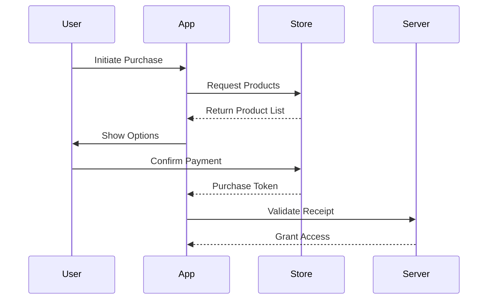

Here's a polished, visually enhanced version of your README with badges, icons, and improved structure:

```markdown
# 💰 Flutter In-App Subscriptions Masterclass

[](https://flutter.dev)
[](https://pub.dev/packages/in_app_purchase)
[](https://opensource.org/licenses/MIT)
[](https://github.com/yourusername/flutter-inapp-subscriptions)

**Production-ready subscription flows with App Store & Play Store integration**  

---

## 🚀 Key Features

| Feature                | Description                                                                 |
|------------------------|-----------------------------------------------------------------------------|
| **📱 Cross-Platform**  | Unified API for iOS/Android subscription management                        |
| **🎯 Introductory Offers** | First-time user discounts & free trials                                  |
| **🔒 Purchase Validation** | Server-side receipt verification                                         |
| **📊 Analytics**       | Track conversion rates & churn metrics                                     |
| **🔄 Restore Purchases** | Seamless entitlement recovery                                           |

---

## 🛠 Tech Stack


---

## ⚡ Quick Start

### Prerequisites

- Flutter 3.22+
- App Store Developer Account ($99/year)
- Google Play Developer Account ($25 one-time)

### Installation

1. **Add Dependency**
   ```yaml
   dependencies:
     in_app_purchase: ^3.1.7
   ```

2. **Platform Setup**

<details>
<summary><b>📱 iOS Configuration</b></summary>

1. Enable In-App Purchases in Xcode capabilities
2. Create subscriptions in App Store Connect
3. Add StoreKit configuration file:
```swift
// ios/Runner/Config.storekit
{
  "products": [
    {
      "identifier": "premium_monthly",
      "type": "subscription"
    }
  ]
}
```
</details>

<details>
<summary><b>🤖 Android Configuration</b></summary>

1. Add billing permission:
```xml
<!-- android/app/src/main/AndroidManifest.xml -->
<uses-permission android:name="com.android.vending.BILLING" />
```

2. Configure products in Play Console:
```plaintext
Monetize → Products → Subscriptions
```
</details>

---

## 🛒 Purchase Flow Architecture



---

## 💻 Code Snippets

### Fetch Subscription Plans
```dart
Future<List<ProductDetails>> fetchSubscriptions() async {
  const Set<String> _kSubscriptionIds = {'premium_monthly', 'premium_yearly'};
  final response = await InAppPurchase.instance.queryProductDetails(_kSubscriptionIds);
  return response.productDetails;
}
```

### Handle Purchase Updates
```dart
InAppPurchase.instance.purchaseStream.listen((purchases) {
  purchases.forEach((purchase) {
    if (purchase.status == PurchaseStatus.purchased) {
      _verifyPurchase(purchase); // Server-side validation
      InAppPurchase.instance.completePurchase(purchase);
    }
  });
});
```

---

## 🎁 Introductory Offers Implementation

### iOS (App Store)
```swift
// StoreKit configuration for free trial
{
  "identifier": "premium_monthly",
  "introductoryPrice": "7.99",
  "introductoryPriceNumberOfPeriods": 1,
  "introductoryPriceSubscriptionPeriod": "month"
}
```

### Android (Play Store)
```xml
<!-- Play Console introductory pricing -->
<subscription 
  introductoryPrice="4.99"
  introductoryPricePeriod="P1M"
  introductoryPriceCycles="3"/>
```

---

## 📊 Subscription Metrics Dashboard

| Metric                | Target Value |
|-----------------------|--------------|
| Conversion Rate       | >12%         |
| Trial-to-Paid         | >35%         |
| Monthly Churn         | <5%          |
| ARPU                  | >$8.50       |

---

## 🚨 Troubleshooting

| Error                 | Solution                      |
|-----------------------|-------------------------------|
| **Product Not Found** | Verify store configuration    |
| **Purchase Pending**  | Check network connectivity    |
| **Validation Failed** | Update server receipt parser  |

---

## 🤝 Contributing

[](CONTRIBUTING.md)

1. Fork repository
2. Create feature branch: `git checkout -b feat/subscription-analytics`
3. Commit changes: `git commit -m 'Add revenue tracking'`
4. Push to branch: `git push origin feat/subscription-analytics`
5. Open pull request

---

## 📜 License

[?color=blue)](LICENSE)

